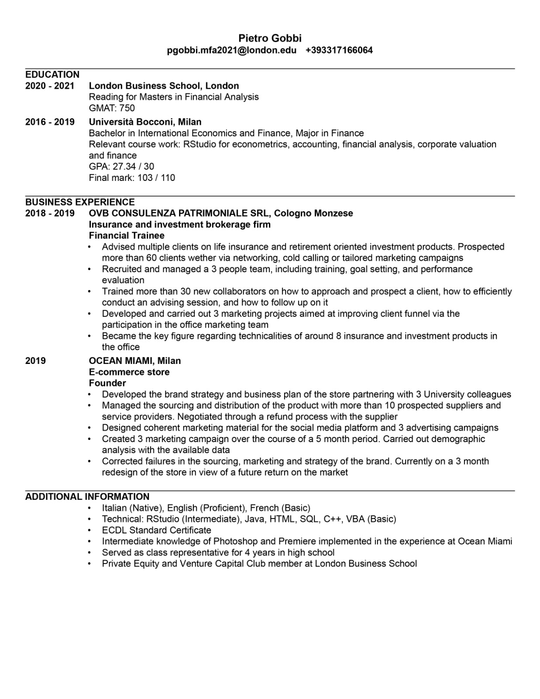

```{r, setup, echo=FALSE}
knitr::opts_chunk$set(
  message = FALSE, 
  warning = FALSE, 
  tidy=FALSE,     # display code as typed
  size="small")   # slightly smaller font for code
options(digits = 3)

# default figure size
knitr::opts_chunk$set(
  fig.width=15, 
  fig.height=15,
  fig.align = "center"
)
```


```{r}
library(knitr)


```
